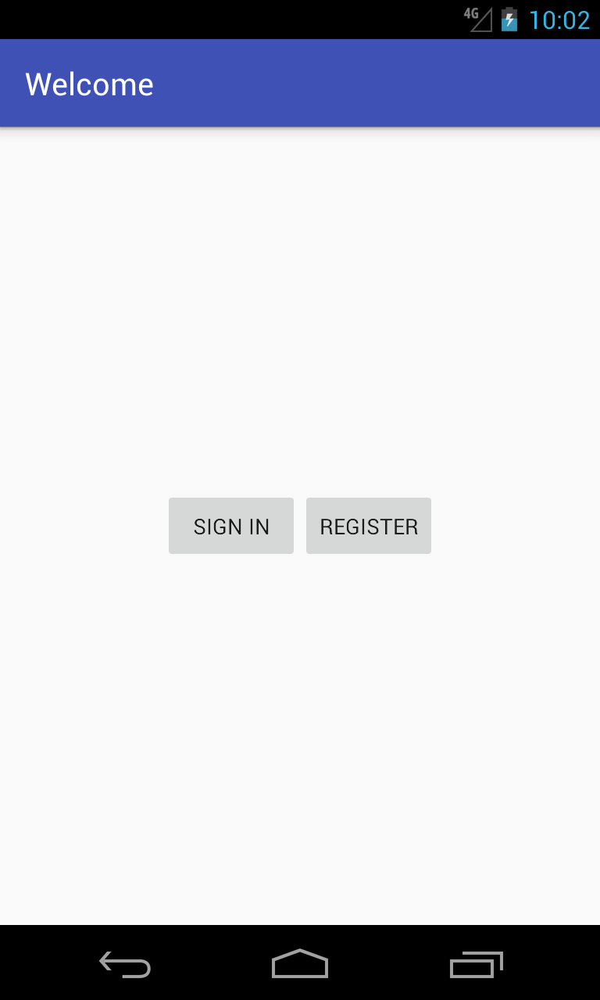
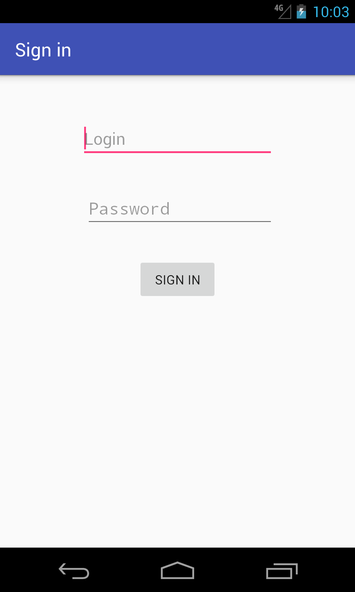
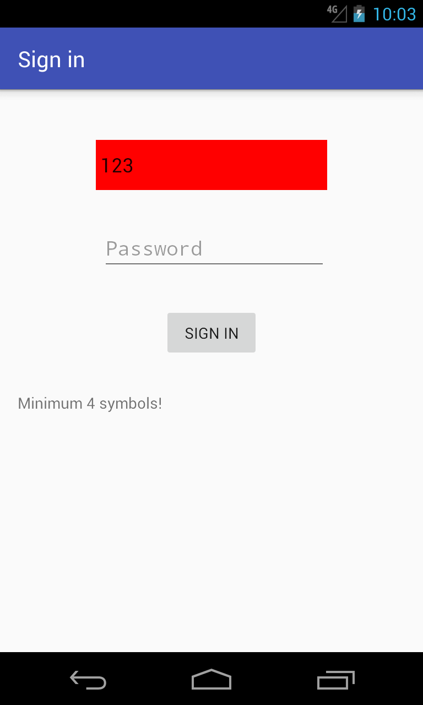
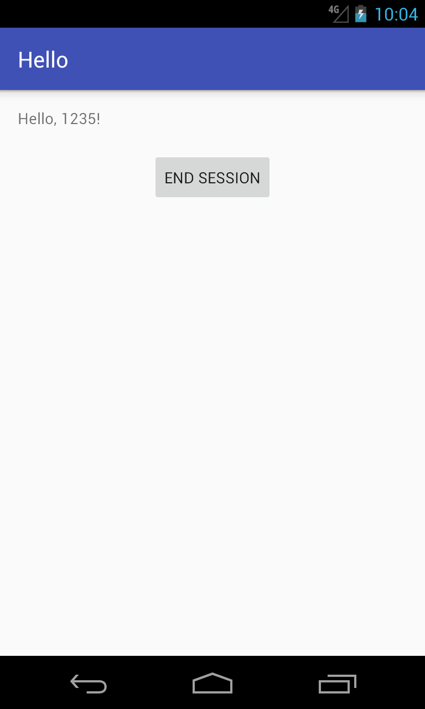

# techmasTest

###Test app with 4 activities:
1) First activity with Buttons "Enter" & "Register"

2) Make activity "Register" with 2 input fields (login and pass), and Button "Register" (onclick - main activity).

3) Make activity "Login" with 2 input fields (login and pass), and Button "Enter" (onclick - main activity).

4) Main activity shows text "Hello, " + username from prevous screens.

###Details:
1) minimum length login\pass - 4 symbols (less - show error, without Toast).

2) at the next start activities "login" and "register" must skips. 
So, there will be only main activity with text "Hello, " + username.

## Screenshots:

